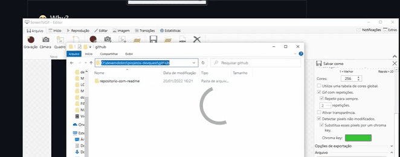

# Projeto com README
Um projeto de teste com um arquivo README 📑
[]

## Tecnologias Utilizadas
- HTML
- CSS
- JS

## Como Utilizar

Clone o Projeto
```
git clone <url>
```
Acesse a pasta do Projeto
```
cd repositorio-com-readme
```

